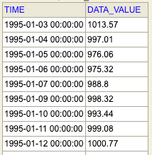
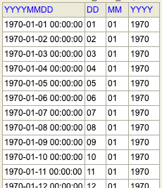
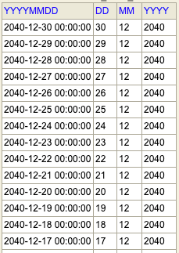
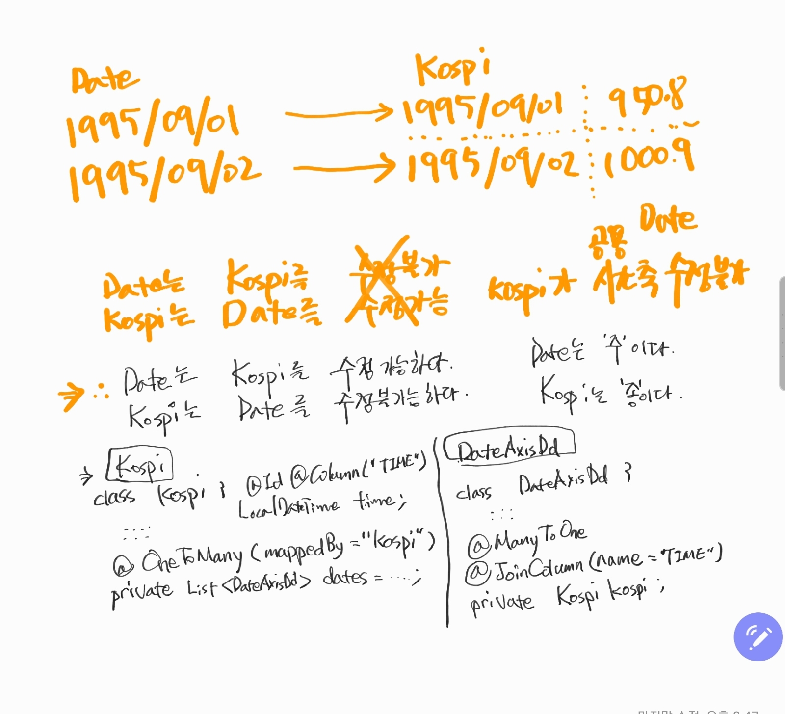

# Entity 매핑 일대다/다대일 매핑
- Kospi 엔티티
    - 테이블 명 : kospi_day
    - 엔티티 명 : Kospi.java
- DateAxisDd
    - 테이블 명 : date_axis_dd
    - 엔티티 명 : DateAxisDd.java  

을 일대다/다대일 매핑하는 과정을 정리해보자.    
일대다/다대일 매핑은 조금 억지스러운 면이 있지만 공부용도로 약간 억지스럽게 예제를 정리한다.

# 참고자료
- [JPA-3. 엔티티 매핑](https://kihoonkim.github.io/2017/01/27/JPA(Java%20ORM)/3.%20JPA-%EC%97%94%ED%8B%B0%ED%8B%B0%20%EB%A7%A4%ED%95%91/)

# 1.데이터 형태
## Kospi
```sql
SELECT TIME, DATA_VALUE FROM KOSPI_DAY;
```
데이터는 아래와 같이 생겼다. 95년 1월 3일 이후부터만 데이터가 존재한다.  
  
  
## DateAxisDd
날짜 축 데이터는 1970 년도 ~ 2040 년도 까지 일별로 생성했다.  
```sql
SELECT * FROM DATE_AXIS_DD;
```
데이터는 아래와 같이 생겼다.  
- 1970 년도 1월 1일 부터 시작해서
- 2040 년도 12월 31일 까지   
이어진다.  
  
1970 년도~  
  
  
2040 년도~  
  
  
## 샘플 데이터 sql 파일
- 테이블 DDL 스크립트
    - application.yml 에서 spring.jpa.hibernate.ddl_auto 를 create 또는 update로 놓고 엔티티 클래스를 작성해 생성하자.
    - 또는 테이블을 직접 생성해서 미리 테스트 하고 싶다면... 테이블 생성 DDL 스크립트는 추후 추가할 예정.. ^^;;
- 데이터 생성 SQL
    - h2 database 의 date_axis_dd, kospi_day 테이블에 데이터를 넣어줄 insert sql 은 [sql 인서트 스크립트들](https://github.com/soongujung/chartnomy/tree/master/worklog/backend/sql/h2/insert) 을 참고해서 샘플데이터를 생성하자.

# 2.엔티티 설계
정말 초 간단하게 요약만 해서 정리해보려고 한다. 누가 물어봤을 때 이런식으로 대답하면 정말 싫어할 수도 있지만... 결론만 놓고 정리해보려 한다.  
정리할 게 너무 많다. 마음은 또 급하다. 헛소리를 정리할 수 도 있을 것 같다.  

## 관계형 DB 엔티티 매핑 vs 객체 중심 엔티티 매핑
엔티티 설계는 JPA 사용시 필수적인 요소이다. 엔티티 설계시 크게 엔티티의 필드와 관계형 DB 테이블 컬럼을 매핑시 
- 관계형 DB 엔티티 매핑
- 객체 중심 엔티티 매핑
과 같은 두가지 방식으로 매핑이 가능하다.

### 관계형 DB 엔티티 매핑 
일반적인 관계형 데이터베이스를 클래스에 매핑시킬 수도 있다. 이러한 경우를 관계형 데이터베이스 매핑이라고 한다.

### 객체 중심 DB 엔티티 매핑
객체 중심으로 관계형 데이터베이스를 매핑하는 과정이다. 테이블 A에 존재하는 하나의 로우 i는 하나의 객체라고 볼수 있는데
이 로우 i 에 대해 매핑되는 테이블 B의 3개의 데이터 로우 들 ii 가 있다고 해보자. i는 ii라는 여러개의 로우를 들고 있을 수 있다.  
이것을 객체지향적으로 표현하면 List 자료구조 등으로 표현가능하다. 이 외에도 주/종 관계를 객체를 통해 뭉탱이로 들고 올수도 있다. 
자세한 설명은 못하겠다. 힘들다. 한 호흡 가다듬고 나중에 차분하게 정리해야 할 듯하다.
  
일단 여기서 객체중심 엔티티 매핑을 하려 한 이유는 단순히 외래키 값으로 조인하는 것이 아니라  
객체간의 연결관계로 조인하는 것을 표현하기 위해서이다.  

### 연관관계의 주인 정하는 방식 (참고자료)
객체 A와 객체 B가 서로 외래키/기본키로 조인되는 관계이면 두 객체중 하나를 연관관계로 지정해야 한다.
- 연관관계의 주인이 아닌 경우
    - 매핑을 당하는 입장일 때이다.
    - mappedBy 속성으로 주인을 지정해준다.
- 연관관계의 주인인 경우 
    - mappedBy 속성은 사용불가이다.
    - 연관관계의 주인이 외래키를 관리한다.
    - 연관관계의 주인은 등록, 수정이 가능하다.
  
## DateAxisDd <--> Kospi 데이터 다대일/일대다 매핑
그림을 여러 번 그려보면서 따져보니, DateAxisDd와 Kospi의 매핑관계는 일대일 매핑으로 하는 것이 맞다.  
시간별 데이터가 아닌 일별데이터이므로 특정날짜의 코스피 데이터는 하나뿐이어야 하므로 일대일 매핑이다.      
특정 날짜에 코스피 종가가 여러 개인 경우는 없으니 말이다. 

그런데... 공부를 하는 입장이라서 그런지 억지로라도 정말 다대일/일대다 매핑으로 만들어보고 싶었다.ㅋㅋ 
그래서 일단은 일대다/다대일로 작성한 엔티티 매핑을 정리해본다.^^

### 매핑시 고려한 요소들
우선 여기서는 ERD를 작성하지 않는다. ERD 상의 매핑 관계가 아니라 엔티티를 억지로 생각해내서 억지로 한번 해본거라 일대다/다대일 관계는 ERD와 맞지 않는다. 
(추후 일대일 매핑 과정을 정리하면서 ERD 매핑, 엔티티 매핑 관계를 그림으로 그려서 정리해놓을 예정이다.)  
  
코스피 입장에서 데이터를 생각해봤다. 코스피는 Date를 수정할 수 없다. DateAxisDd 입장에서는 코스피의 특정 데이터를 date(yyyymmdd)값을 키로 접근해 수정할 수 있어야 한다.  
코스피 입장에서 DateAxisDd를 수정할 수 없는 것의 의미는 아래와 같다.
> - 공통으로 사용할 시간축 테이블인 DateAxisDd 를 코스피가 수정하면 안된다. 
> - 현실세계에 대입해 생각해보자.
>   - 코스피가 현실 세계의 시간을 수정할 수는 없다.

그림으로 그려봤던 내용은 아래와 같다.


### 코드
#### DateAxisDd (주)
```java
package com.chartnomy.indicators.domain.axis.entity;

import com.chartnomy.indicators.domain.kospi.entity.Kospi;
import java.time.LocalDateTime;
import javax.persistence.Column;
import javax.persistence.Entity;
import javax.persistence.Id;
import javax.persistence.JoinColumn;
import javax.persistence.ManyToOne;
import javax.persistence.Table;
import lombok.Getter;
import lombok.Setter;

@Entity
@Getter
@Setter
@Table(name = "DATE_AXIS_DD")
public class DateAxisDd {
	@Id
	@Column(name = "yyyymmdd")
	private LocalDateTime date;

	@ManyToOne
	@JoinColumn(name = "TIME")
	private Kospi kospi;

	@Column(name = "yyyy")
	private String year;

	@Column(name = "mm")
	private String month;

	@Column(name = "dd")
	private String dayOfMonth;

	public DateAxisDd(){}
}
```

아래의 필드를 통해 매핑 관계를 추가해 주었다. 
- DateAxisDd가 주인이기 때문에 mappedBy는 사용하지 않는다.
- DateAxisDd가 주인이므로 매핑할 객체인  
    - private Kospi kospi; 를 추가해준다.
- 주인인 DateAxisDd가 Join할 컬럼을 지정하기 위해 @JoinColumn을 지정해준다.
- JoinColumn의 이름은 "TIME" 이다. 
> ```java
> @ManyToOne
> @JoinColumn(name="TIME")
> private Kospi kospi;
>```

#### Kospi (종)
Kospi는 DateAxisDd로 언제든지 조회될 수 있으므로 종 관계이다.
```java
package com.chartnomy.indicators.domain.kospi.entity;

import com.chartnomy.indicators.domain.axis.entity.DateAxisDd;
import java.time.LocalDateTime;
import java.util.ArrayList;
import java.util.List;
import javax.persistence.Column;
import javax.persistence.Entity;
import javax.persistence.Id;
import javax.persistence.OneToMany;
import javax.persistence.Table;
import lombok.Getter;
import lombok.Setter;

@Entity
@Getter
@Setter
@Table(name = "kospi_day")
public class Kospi {
	@Id
	@Column(name = "TIME")
	private LocalDateTime time;

	@OneToMany(mappedBy = "kospi")
	private List<DateAxisDd> dates = new ArrayList<>();

	@Column(name = "STAT_NAME")
	private String statName;

	@Column(name = "STAT_CODE")
	private String statCode;

	@Column(name = "DATA_VALUE")
	private Double price;

	@Column(name = "ITEM_CODE1")
	private String itemCode1;

	@Column(name = "ITEM_CODE2")
	private String itemCode2;

	@Column(name = "ITEM_CODE3")
	private String itemCode3;

	@Column(name = "ITEM_NAME1")
	private String itemName1;

	@Column(name = "ITEM_NAME2")
	private String itemName2;

	@Column(name = "ITEM_NAME3")
	private String itemName3;

	public void Kospi(){}
}
```

dateAxisDd의 yyyymmdd 데이터 하나로 여러개의 Kospi지수를 들고올 수 있다는 가정하에 추가했으므로  
kospi는 종 이다. 그런 이유로 아래와 같이 선언했다.
```java
@OneToMany(mappedBy = "kospi")
private List<DateAxisDd> dates = new ArrayList<>();
```
  
DateAxisDd.java 내에 Kospi 타입의 객체는 
- private Kospi kospi;  

로 선언되어 있다. mappedBy = "kospi" 에서의 kospi는 DateAxisDd 클래스 내에 선언한 변수 kospi의 변수명 임을 지칭한다.  
Kospi 입장에서는 DateAxisDd를 여러개 가질 수 있다.


#### 테스트 코드
```java
package com.chartnomy.indicators.h2.insert;

import com.chartnomy.indicators.api.web.trending.index.dto.QTrendingDto;
import com.chartnomy.indicators.api.web.trending.index.dto.TrendingDto;
import com.chartnomy.indicators.domain.axis.entity.DateAxisDd;
import com.chartnomy.indicators.domain.axis.entity.QDateAxisDd;
import com.chartnomy.indicators.domain.kospi.entity.Kospi;
import com.chartnomy.indicators.domain.kospi.entity.QKospi;
import com.querydsl.jpa.impl.JPAQueryFactory;
import java.util.List;
import javax.persistence.EntityManager;
import org.junit.jupiter.api.BeforeEach;
import org.junit.jupiter.api.Test;
import org.springframework.beans.factory.annotation.Autowired;
import org.springframework.boot.test.context.SpringBootTest;
import org.springframework.test.context.ActiveProfiles;

@SpringBootTest
@ActiveProfiles("test")
//@Transactional
//@Commit
public class DateAxisDdTest {

	@Autowired
	private EntityManager em;

	private JPAQueryFactory queryFactory;

	@BeforeEach
	public void setup(){
		queryFactory = new JPAQueryFactory(em);
	}

	@Test
	public void test1(){
		System.out.println("test1");
		QDateAxisDd dateAxisDd = QDateAxisDd.dateAxisDd;
		List<DateAxisDd> data = queryFactory.selectFrom(dateAxisDd)
			.fetch();
		System.out.println(data);
	}

	@Test
	public void leftJoinTest1(){
		QDateAxisDd dateAxisDd = QDateAxisDd.dateAxisDd;
		QKospi kospi = QKospi.kospi;

		List<TrendingDto> result =
			queryFactory.select(
				new QTrendingDto(
					kospi.itemCode1.as("itemCode1"),
					dateAxisDd.date.as("date"),
					kospi.price.as("kospiPrice")
				)
			)
			.from(dateAxisDd)
			.leftJoin(kospi)
				.on(dateAxisDd.date.eq(kospi.time))
			.fetch();

		for(TrendingDto d : result){
			System.out.println(d.getDate() + " : " + d.getKospiPrice());
		}
	}

	@Test
	public void leftJoinTest2(){
		QDateAxisDd dateAxisDd = QDateAxisDd.dateAxisDd;
		QKospi kospi = QKospi.kospi;

		List<Kospi> result = queryFactory.selectFrom(kospi)
			.leftJoin(dateAxisDd)
//			.on(dateAxisDd.date.eq(kospi.time))
			.on(kospi.time.eq(dateAxisDd.date))
			.fetch();

		for(Kospi k : result){
			System.out.println(k.getTime());
		}
	}

	@Test
	public void joinTest(){
		QDateAxisDd dateAxisDd = QDateAxisDd.dateAxisDd;
		QKospi kospi = QKospi.kospi;

		List<DateAxisDd> data = queryFactory.selectFrom(dateAxisDd)
			.join(kospi)
			.on(dateAxisDd.date.eq(kospi.time))
			.fetch();

		for(DateAxisDd d : data){
			System.out.println(d.getDate());
		}
	}
}
```

