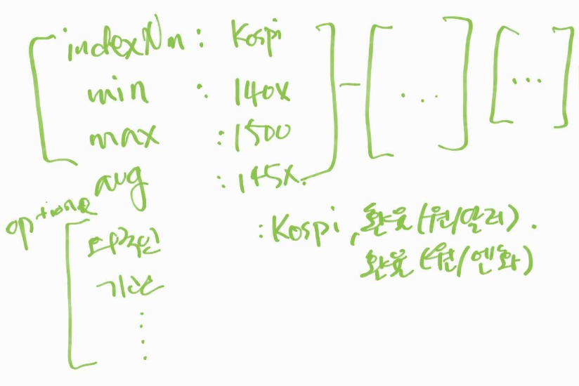
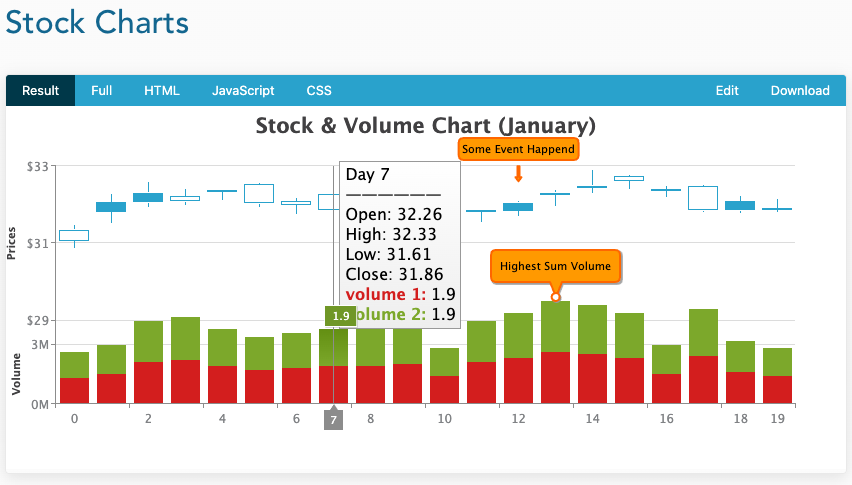

# INDEX 데이터 API 기획 
# 1. 일별 데이터
## 1.1 일별 데이터의 기준 
일별 데이터로 취급되는 항목은 아래와 같다.
- KOSPI
- S&P 500
- 환율(원/달러)
- 환율(원/엔화)

각 일별 데이터 조회시
- 해당 년/월 에서의 최대값
- 해당 년/월 에서의 최소값
- 해당 년/월 에서의 평균값
을 조회해온다.

## 1.2 일별 데이터 조회 API
- 각각의 데이터는 인출해 온 후 groupBy, maxBy, minBy 등을 통해 가공을 거치도록 한다.
- DB에 저장된 raw 데이터는 가급적 SQL로 GroupBy 등을 통한 집계로직으로 가공하지 않는것을 원칙으로 한다.
- leftJoin을 최대한 줄이도록 한다.

## 1.3 일별 데이터 계획

### 1.2.1 일별 데이터 단건 조회 (각각의 조회) API URL
- /api/trending/index/{category}?startDate=YYYYMMDD&endDate=YYYYMMDD
    - startDate, endDate 는 선택적인 파라미터이다.
    - startDate, endDate 가 없을 경우 1960년도 부터 현재까지의 데이터를 인출해온다.

### 1.2.2 일별 데이터 통합 조회 
- /api/trending/index/{category}/all?startDate=YYYYMMDD&endDate=YYYYMMDD
    - startDate, endDate 는 선택적인 파라미터이다.
    - startDate, endDate 가 없을 경우 1960년도 부터 현재까지의 데이터를 인출해온다.
    1. KOSPI, S&P500, 환율(원/달러), 환율(원/엔화) 등의 데이터를 각각 DB에서 인출해 온 후
    2. 각각에 대해 
        - 해당 년/월 에서의 최대값
        - 해당 년/월 에서의 최소값
        - 해당 년/월 에서의 평균값
        을 Stream API 를 통해 가공한다. 이 기능은 1.2.1 에서 정의한 함수를 재활용 할 수 있도록 구현한다.
    3. 2 에서 구해온 값을 병합하여 리턴한다.
        - 리턴 데이터의 형식
        
# 2. 월별 데이터
월별 데이터의 종류는 아래와 같다.
- 금리(한국/미국)

1. Spring Batch 를 통해 월별 데이터를 집계해 저장한다.
2. 또는 월별 데이터로 한국은행 API에 요청하여 데이터를 가져온다.
두가지 방식 중 하나를 선택하자.

# 3. 개별 지표 단건 상세조회 페이지
- 조회하려는 지표(금리, KOSPI, 환율)을 선택하여 조회할 수 있다.  
- 기본 파라미터 조건은 startDate = 19600101, endDate = 현재시간 이다.
- 기본 선택 지표는 KOSPI, 금리이다.

데이터 표현 예시
- [예제 링크](https://www.zingchart.com/docs/chart-types/stock)
- 
 